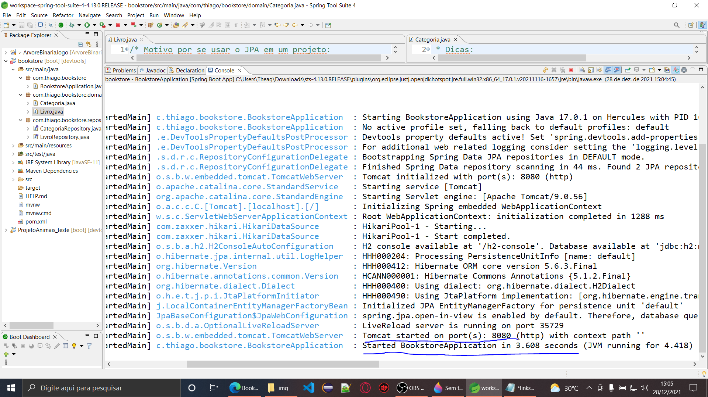

<h2><b>Bookstore A.P.I - SpringBoot</b></h2>

 2021, Thiago Hercules. All rights reserved.  

• OBS: Projeto inacabado! Front-end ainda em teoria  
↳ Desenvolvido ao vivo no youtube: https://www.youtube.com/watch?v=9sFL_1-VN6A&t=1597s

<h3><b> <em>🗃️ About project: </em> </b> </h3>

 • Project readjusted for a last minute java jr developer job, however, project planning and ideology such as API consumption, integration with database made, front-end unfinished. 
  

 • Projeto reajustado para uma vaga de desenvolvedor java jr de última hora, porém, planejamento e ideologia do projeto como consumo da API, integração com banco feitos, front-end inacabado. 

 

<h3><em>• Front-end em angular ainda não finalizado e integrado // Angular front-end not yet finalized and integrated </h3>
 </img> 
 </img> 
 </img> 
 </img>   
<h3><em>• Código-fonte do angular no VSCode // Angular source code in VSCode </h3>
 </img>   
<h3><em>• Planejamento de consumo da aplicação // Application consumption planning </h3>
 </img>   
<h3><em>• Back-end sendo desenvolvido em java // Backend being developed in java </h3>
 </img>
 </img>    
<h3><em>• Erro padrão do spring demonstrando funcionalidade ao compilar // Spring standard error demonstrating functionality when compiling </h3>
 </img>   
<h3><em>• Login no Banco de dados funcional // Login to Functional Database </h3>
 </img>   
<h3><em>• Programando a pequena API em tempo real // Programming the small API in real time </h3>
 </img>   
 

<em><b>Languages in front-end:</b></em> 

 

<em><b>Framework:</b></em> 

<em><b>I.D.E:</b></em> 

 
 

<em><b>Languages in back-end:</b></em> 

<em><b>Framework:</b></em> 

<em><b>DataBase:</b></em> 

<em><b>I.D.E:</b></em> 

 

<h1><b>Hello, my name is Thiago Hercules 👋</b><i class="fas fa-code"></i></h1>

<em>Jr. fullstack developer. | Freelancer Designer. </em>

<h3><em><b>🌍About me:🧠</b></em></h3> 

 Hello, my name is Thiago Hercules, I'm 19 years old and I'm a 5th period Computer Science student at UNIFG. My main goal is to become a fullstack developer. I have knowledge in all programming STACKS, with emphasis on Java back-end. My studies in programming go back to the year 2016 with the beginning of the Java Academy at fuctura tecnology and continue until today with the present trainings and developed projects. As I studied in a reference school, I was introduced to robotics and IOT development early on, where I participated in the Brazilian Robotics Olympiad (OBR) in 2018 and in the official LEGO FLL (First Lego League) tournament in the Hydro Dinamics version in 2017. Recently in the year 2021 I joined as dev. manager at jupiter consulting, acting as leader of a development team and coagulating with my personal projects.

  

 

<h3><em><b> 🔹 I programming in: 🎓</b></em></h3> 

 

 

<h3><em><b> 🔹 Languages of i need to improve myself: 😬</b></em></h3>

 

<h3><em><b> 🔹 I am interested in: 🧐</em><b></h3> 

	
<h3><em><b> 🔶 About BootCamps: 🚀</em><b></h3> 

 --> Bootcamp developer mobile | IGTI ✅ 

